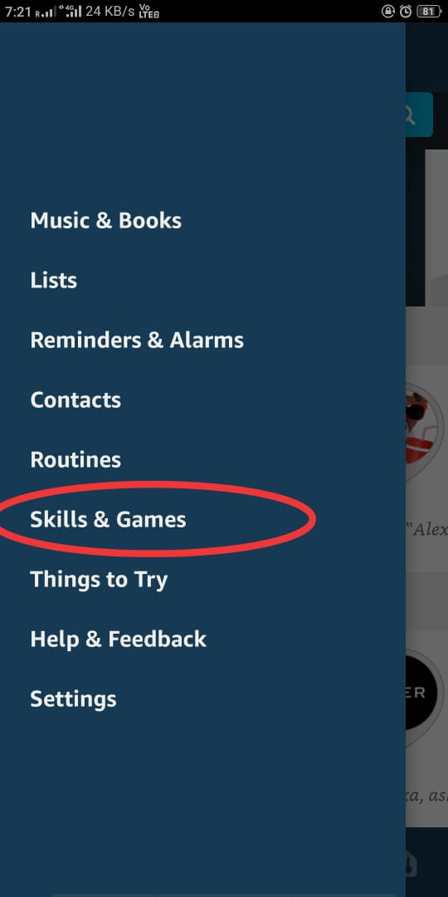
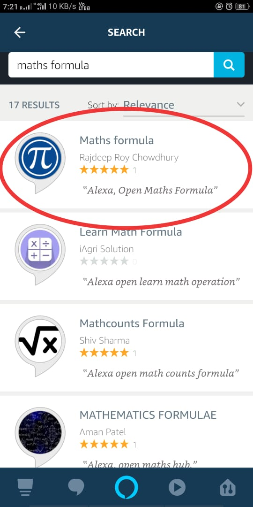
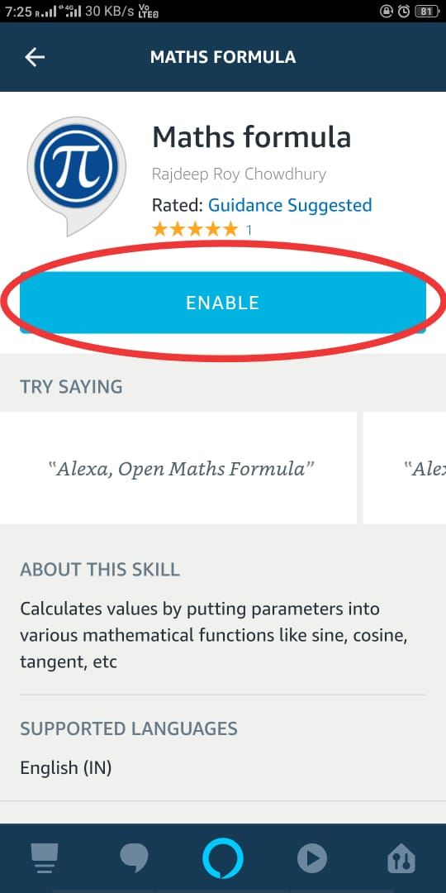

# Maths Formula
An Alexa skill for calculations

The Frontend part of the skill is [MathsFormulaIntents.md](./MathsFormulaIntents.md).

The Backend part of the skill is handled by [lamdba_function.py](./lambda_function.py), which is an AWS Lambda Function.

## Accessing MathsFormula Skill in your device

### Android
1. Download Amazon Alexa app from the playstore.
2. Open Amazon Alexa app in your android phone.
3. From the navigation option, select `Skills & games`.

4. Type `Maths Formula` in the search bar and hit the search button.
5. Select the skill as shown below
   

6. Tap on `Enable`.
   

7. Get back to the home screen of the Alexa app.
8. Say "Alexa open Maths Formula".
9. Now, the skill is ready to use.

## What can you ask?
Currently the Maths formula support the following features...
  * Say **Learn Maths Formula**
  * Ask **What is the sine of 39 degree?**(or any other trigonometric functions)
  * Ask **What is the factorial of 5?**
  * Ask **What is the value of 9 to the power 3?"**
  * Ask **What is the sum of first 20 numbers?**
  * Ask **What is the value of 6 P 3?**(Permutaion & combination both supported)
  * Ask **Who created you?**
  